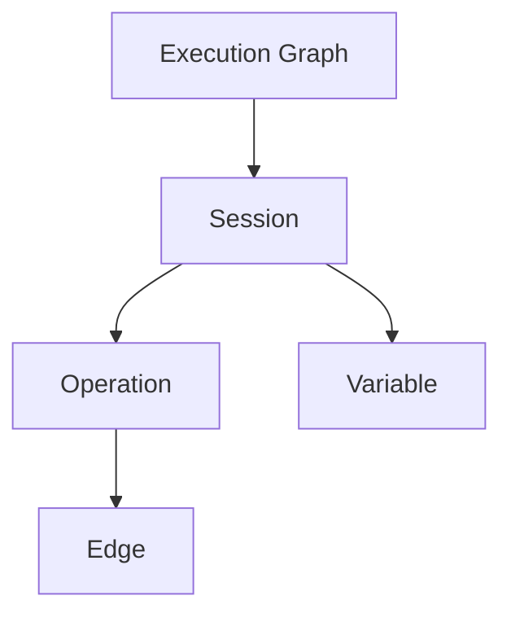

# Core Concepts

This page explains **what an execution graph is**, and the **data model** that `smartcomment` uses to represent it.

---

## 1. Execution Graph

An **execution graph** is a record of how data flows through a program run. It captures not only *which* steps execute, but *how* information moved between them:

- **Variables** are the intermediate artifacts a program produces or consumes (an integer, a response from a large language model, a request queue).
- **Operations** are the developer-marked computational steps that transform variables (a JSON parsing function, a numerical aggregation, an API request).
- **Edges** connect an upstream variable to a downstream variable, recording a causal dependency. Every edge remembers which operation induces it.

Unlike event-centric tracers (which log spans and function calls), `smartcomment` makes **dependencies between variables first-class**. This is what lets you later ask questions such as *"which earlier variables causally contributed to this faulty output?"* or *"what does the overall execution flow of this system look like?"*

> **Engineering note.** In the MemTrace paper, an execution graph is defined as a bipartite graph whose node set is partitioned into variables and operations. Edges are only allowed between variable nodes and operation nodes. In `smartcomment`, however, variables are connected directly by edges, and each edge stores the identifier of the operation that induces the dependency.

---

## 2. Hierarchical Data Model

`smartcomment` organizes a trace using a four-level hierarchy:



| Level | Schema |
|:-----:|:------:|
| Graph | `RuntimeGraph` |
| Session | `RuntimeSession` |
| Operation | `RuntimeOp` |
| Variable | `RuntimeVariable` |
| Edge | `RuntimeEdge` |

Note that a session is simply a named stage of a run that groups the operations and variables created while it is active. A graph can contain many sessions, which means sessions provide a way to partition a graph into multiple stages.

---

## 3. Typical Usage

A typical usage looks like:

```python
from smartcomment import (
    comment_graph,
    comment_session,
    comment_variable,
    comment_op,
)

# 1. Create a context that maintains an execution graph. 
with comment_graph(...) as graph:  
    # 2. Create a session context in which tracking of variables and operations is bound to this session.
    with comment_session(...) as session: # 2. a stage
        # 3. Use `comment_variable` and `comment_op` to track variables and relevant operations.    
```

Let's take a tiny arithmetic operation as an example:

```python
from smartcomment import (
    comment_graph,
    comment_session,
    comment_variable,
    comment_op,
)

with comment_graph() as graph:
    with comment_session(
        session_name="arithmetic",
        comment="A tiny arithmetic stage.",
    ) as session:
        # Register three starting values as tracked variables.
        # `comment_variable` returns the input value unchanged. 
        a = comment_variable(
            1.0,
            id_strategy="object_id",
            comment="Operand a.",
        )
        b = comment_variable(
            2.0,
            id_strategy="object_id",
            comment="Operand b.",
        )
        c = comment_variable(
            3.0,
            id_strategy="object_id",
            comment="Operand c.",
        )

        d = a + b + c
        
        op = comment_op(
            op_name="sum",
            inputs=[a, b, c],
            outputs=[d],
            id_strategy="object_id",
            comment="Add three numbers into their sum.", 
        )
```

You may notice that several calls provide a `comment`. A comment is a human-readable annotation attached to a traced object, just like an ordinary code comment: here, `comment="Operand a."` explains the variable `a`, while `comment="Add three numbers into their sum."` explains the operation. Comments are optional, but they make the execution graph much easier to inspect later.

The example also uses `id_strategy="object_id"`. An identity strategy tells `smartcomment` how to decide whether two runtime values should be treated as the same traced variable. The built-in `object_id` strategy uses Python's object identity, so two references to the same in-memory object share one traced identity, while different objects are treated as different variables. **This is convenient when tracking objects by reference inside a single Python run, as long as the tracked objects stay alive and are not garbage-collected during the period you need to identify them**.

---


## 4. Inspecting Execution Graph

After running the tracing code above, you can obtain different read-only handles, such as `RuntimeGraph`, `RuntimeOp`, `RuntimeSession`, `RuntimeVariable`, and `RuntimeEdge`. You can inspect the recorded trace through these handles.

### 4.1 The Whole Graph

The `graph` object returned by `comment_graph` is an `ExecNetwork`. To inspect the graph through a read-only graph handle, call `to_runtime_graph()` and then render the resulting `RuntimeGraph`.

```python
runtime_graph = graph.to_runtime_graph()
print(runtime_graph.to_markdown())
```

The output is:

```text
## Graph

### Nodes (4)

**float:132323914557424** (v1)
- Full Node ID: `float:132323914557424@1`
- Value: `1.0`
- Comment: Operand a.
- Category: variable
- Created At: created in the system at `2026-05-31 22:31:49.950`

**float:132323854594352** (v1)
- Full Node ID: `float:132323854594352@1`
- Value: `2.0`
- Comment: Operand b.
- Category: variable
- Created At: created in the system at `2026-05-31 22:31:49.964`

**float:132323854594384** (v1)
- Full Node ID: `float:132323854594384@1`
- Value: `3.0`
- Comment: Operand c.
- Category: variable
- Created At: created in the system at `2026-05-31 22:31:49.970`

**float:132323469738736** (v1)
- Full Node ID: `float:132323469738736@1`
- Value: `6.0`
- Category: variable
- Created At: created in the system at `2026-05-31 22:31:49.976`

### Edges (3)

**Edge: `float:132323914557424@1` -> `float:132323469738736@1`**
- Edge ID: `edge-b5463cc2bf854190aaaeda0d997f1022`
- Category: operation
- Comment: Add three numbers into their sum.
- Created At: created in the system at `2026-05-31 22:31:49.976`

**Edge: `float:132323854594352@1` -> `float:132323469738736@1`**
- Edge ID: `edge-60bb28c5e2a947e38506de419500d056`
- Category: operation
- Comment: Add three numbers into their sum.
- Created At: created in the system at `2026-05-31 22:31:49.976`

**Edge: `float:132323854594384@1` -> `float:132323469738736@1`**
- Edge ID: `edge-b9beec7a9e014c0aa8d475ce04a67397`
- Category: operation
- Comment: Add three numbers into their sum.
- Created At: created in the system at `2026-05-31 22:31:49.976`

### Operations (1)

**Op: sum**
- Operation ID: `op-2aeb923a6aad4fbba68338d3a6aa9a42`
- Category: operation
- Comment: Add three numbers into their sum.
- Created At: created in the system at `2026-05-31 22:31:49.975`
```

### 4.2 A Single Variable

```python
print(runtime_graph.nodes[0].to_markdown())
```

The output is:

```text
**float:132323914557424** (v1)
- Full Node ID: `float:132323914557424@1`
- Value: `1.0`
- Comment: Operand a.
- Category: variable
- Created At: created in the system at `2026-05-31 22:31:49.950`
```

### 4.3 A Single Operation

The `comment_op` call returns the corresponding read-only operation handle. Since the example stores it in `op`, we can inspect the operation directly.

```python
print(op.to_markdown())
```

The output is:

```text
**Op: sum**
- Operation ID: `op-2aeb923a6aad4fbba68338d3a6aa9a42`
- Category: operation
- Comment: Add three numbers into their sum.
- Created At: created in the system at `2026-05-31 22:31:49.975`
```

### 4.4 A Single Session

The `comment_session` context manager yields the corresponding read-only session handle. Since the example stores it in `session`, we can inspect the session directly.

```python
print(session.to_markdown())
```

The output is:

```text
**Session: arithmetic**
- Session ID: `session-8720acf40c4b45c2bcfcdbc2eb14b850`
- Category: session
- Comment: A tiny arithmetic stage.
- Created At: created in the system at `2026-05-31 22:31:49.944`
```

### 4.5 A Single Edge

Edges can also be rendered to Markdown. You can grab them from the runtime graph:

```python
print(runtime_graph.edges[0].to_markdown())
```

The output is:

```text
**Edge: `float:132323914557424@1` -> `float:132323469738736@1`**
- Edge ID: `edge-b5463cc2bf854190aaaeda0d997f1022`
- Category: operation
- Comment: Add three numbers into their sum.
- Created At: created in the system at `2026-05-31 22:31:49.976`
```

---

**Next:** [Quick Start →](quick_start.md)
