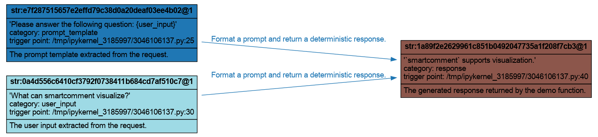
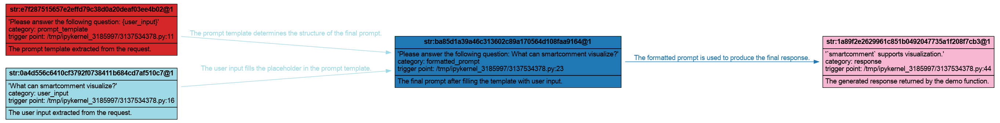

# Fine-Grained Tracing

The quick start uses `comment_fn`, which automatically turns a function call into one operation with function arguments as inputs and the return value as the output. This page shows the more fine-grained APIs:

- `comment_variable` records a Python value as a variable node.
- `comment_op` records an operation from input variables to output variables.
- `comment_op_scope` creates an operation context.
- `comment_link` creates one directed edge at a time inside that operation context.

We reuse the same theme from [Visualization](visualization.md), but make the example slightly more realistic. The `get_response` function now accepts a single request dictionary. It first validates the request with `validate_input`, extracts `prompt_template` and `user_input`, and then returns a deterministic response.

---

## 1. Manual Tracing with `comment_variable` and `comment_op`

Use this style when you think a function-level trace is too coarse.

```python
from smartcomment import (
    comment_link,
    comment_op,
    comment_op_scope,
    comment_variable,
    draw_graph,
)


def validate_input(request: dict[str, str]) -> tuple[str, str]:
    """Validate a request and extract the prompt template and user input."""
    if "prompt_template" not in request:
        raise ValueError("The request must contain `prompt_template`.")
    if "user_input" not in request:
        raise ValueError("The request must contain `user_input`.")
    return request["prompt_template"], request["user_input"]


def get_response(
    request: dict[str, str],
) -> str:
    """Return a deterministic response with manual operation tracing."""
    prompt_template, user_input = validate_input(request)

    prompt_template = comment_variable(
        prompt_template,
        category="prompt_template",
        comment="The prompt template extracted from the request.",
    )
    user_input = comment_variable(
        user_input,
        category="user_input",
        comment="The user input extracted from the request.",
    )

    prompt = prompt_template.format(user_input=user_input)
    model = lambda prompt: "`smartcomment` supports visualization."
    response = model(prompt)

    comment_op(
        op_name="demo.get_response",
        category="llm_response",
        comment="Format a prompt and return a deterministic response.",
        inputs=[
            prompt_template,
            user_input,
        ],
        outputs=[
            (
                response,
                {
                    "category": "response",
                    "comment": "The generated response returned by the demo function.",
                },
            ),
        ],
    )

    return response
```

Here, `validate_input` still runs as normal Python code, but we choose not to trace the raw request dictionary. Instead, we start the execution graph from the two extracted values: `prompt_template` and `user_input`. `comment_variable` records those values while returning the original Python values unchanged. Passing them to `comment_op` is enough: `smartcomment` resolves them to the variables that are just recorded. The output is configured with a value-option tuple.

Visualize this manual trace with `draw_graph`:

```python
draw_graph(
    get_response,
    fn_kwargs={
        "request": {
            "prompt_template": "Please answer the following question: {user_input}",
            "user_input": "What can smartcomment visualize?",
        },
    },
    backend="graphviz",
    filename="fine_grained_tracing",
    format="png",
    max_str_len=120,
)
```

This produces a graph that starts from the values we care about:

<p align="center">
  
</p>

---

## 2. Edge-Level Tracing with `comment_op_scope` and `comment_link`

Sometimes one operation contains multiple internal dependency steps, and you want each edge to carry a different comment. In that case, use `comment_op_scope` to create the operation context, and use `comment_link` to add one edge at a time.

In the example below, we expose the intermediate formatted prompt as a variable:

```python
def get_response_(
    request: dict[str, str],
) -> str:
    """Return a deterministic response with edge-level tracing."""
    with comment_op_scope(
        op_name="demo.get_response",
        category="response_generation",
        comment="Build a prompt and return a response.",
    ):
        prompt_template, user_input = validate_input(request)
        prompt_template = comment_variable(
            prompt_template,
            category="prompt_template",
            comment="The prompt template extracted from the request.",
        )
        user_input = comment_variable(
            user_input,
            category="user_input",
            comment="The user input extracted from the request.",
        )

        prompt = prompt_template.format(user_input=user_input)
        prompt = comment_variable(
            prompt,
            category="formatted_prompt",
            comment="The final prompt after filling the template with user input.",
        )

        comment_link(
            source=prompt_template,
            target=prompt,
            category="prompt_formatting",
            comment="The prompt template determines the structure of the final prompt.",
        )
        comment_link(
            source=user_input,
            target=prompt,
            category="prompt_formatting",
            comment="The user input fills the placeholder in the prompt template.",
        )

        model = lambda prompt: "`smartcomment` supports visualization."
        response = model(prompt)
        response = comment_variable(
            response,
            category="response",
            comment="The generated response returned by the demo function.",
        )
        
        comment_link(
            source=prompt,
            target=response,
            category="llm_response",
            comment="The formatted prompt is used to produce the final response.",
        )

    return response


draw_graph(
    get_response_,
    fn_kwargs={
        "request": {
            "prompt_template": "Please answer the following question: {user_input}",
            "user_input": "What can smartcomment visualize?",
        },
    },
    backend="graphviz",
    filename="fine_grained_comment_link",
    format="png",
    max_str_len=120,
)
```

The output image looks like:

<p align="center">
  
</p>

---

**Next:** [Operation Reuse →](operation_reuse.md)