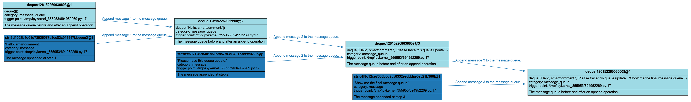

# In-Place Operation

Many Python programs update mutable objects in place. For example, a message buffer may be represented by a list, a dictionary, or a double-ended queue. If you only record the object after all updates finish, you lose the history of how the object changes.

`comment_mutation` records this pattern. It snapshots the target object before the `with` block, lets your code mutate the object inside the block, and then records the mutated value as a new version when the block exits.

---

## 1. Append Messages to a Queue

The example below appends three message strings into a double-ended queue. Each append is an in-place update to the same queue object, so we wrap the append operation with `comment_mutation`.

```python
from collections import deque
from smartcomment import comment_mutation, draw_graph


def build_message_queue() -> deque[str]:
    """Append messages to a queue and trace each in-place update."""
    message_queue = deque()
    messages = [
        "Hello, smartcomment.",
        "Please trace this queue update.",
        "Show me the final message queue.",
    ]

    latest_queue_var = None

    for index, message in enumerate(messages, start=1):
        with comment_mutation(
            target=message_queue,
            inputs=[
                (
                    message,
                    {
                        "id_strategy": "content",
                        "category": "message",
                        "comment": f"The message appended at step {index}.",
                    },
                ),
            ],
            id_strategy="object_id",
            category="message_queue",
            comment="The message queue before and after an append operation.",
            mutation_name="message_queue.append",
            mutation_category="queue_update",
            mutation_comment=f"Append message {index} to the message queue.",
            mutation_metadata={
                "step": index,
            },
        ) as mutation:
            message_queue.append(message)

        # After the with block exits, `mutation.result` is a runtime variable 
        # for the updated queue version.
        latest_queue_var = mutation.result

    if latest_queue_var is not None:
        print(latest_queue_var.to_markdown(include_metadata=True))

    return message_queue
```

There are three important details. Firstly, `target=message_queue` must be the mutable Python object itself. **Do not pass a runtime variable as the target**. Secondly, `mutation.result` is available **after** the `with` block exits. It is a read-only runtime variable for the new queue version produced by that mutation. Thirdly, **for in-place mutations, the target object should usually use a stable identity strategy**. If we used the default content-based identity for the queue, each different queue content (`deque([])`, `deque(["Hello"])`, ...) would be treated as a different logical identity when the next mutation starts. The graph would then look like several disconnected mutation fragments instead of one continuous version chain. With `id_strategy="object_id"`, all queue versions share the same logical identity, so the trace forms a clean version trajectory.


Use `draw_graph` to run the function and immediately render the execution graph:

```python
draw_graph(
    build_message_queue,
    backend="graphviz",
    filename="in_place_message_queue",
    format="png",
    max_str_len=120,
)
```

The output is: 

```text
**deque:126152269036608** (v4)
- Full Node ID: `deque:126152269036608@4`
- Value: `deque(['Hello, smartcomment.', 'Please trace this queue update.', 'Show me the final message queue.'])`
- Comment: The message queue before and after an append operation.
- Category: message_queue
- Created At: created in the system at `2026-06-01 19:31:15.481`
```

The output image looks like:


<p align="center">
  
</p>

The graph shows not only the version trajectory of the queue, but also the extra variables involved in each update. These variables are passed to `comment_mutation` through the `inputs` argument.

---

**Next:** [Tricks →](tricks.md)