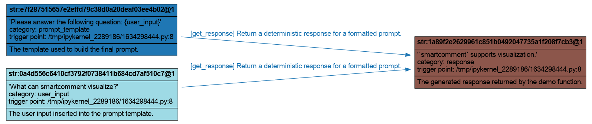

# Visualization

`smartcomment` can render an execution graph after it records a traced run. This is useful when you want to quickly inspect the flow of variables through a system, validate whether your instrumentation covers the right steps.

Install the optional visualization dependencies with:

```bash
pip install smartcomment[viz]
```

---

## 1. A Small Traced Function

We start with a synchronous function `get_response`. It accepts two arguments: a prompt template string and a user input string. It formats the prompt and returns a deterministic response.

```python
from smartcomment import (
    comment_fn,
    comment_graph,
    draw_graph,
)


@comment_fn(
    category="response_generation",
    param_options={
        "prompt_template": {
            "category": "prompt_template",
            "comment": "The template used to build the final prompt.",
        },
        "user_input": {
            "category": "user_input",
            "comment": "The user input inserted into the prompt template.",
        },
        "-o": {
            "category": "response",
            "comment": "The generated response returned by the demo function.",
        },
    },
)
def get_response(prompt_template: str, user_input: str) -> str:
    """Return a deterministic response for a formatted prompt."""
    prompt = prompt_template.format(user_input=user_input)
    model = lambda prompt: "`smartcomment` supports visualization."
    return model(prompt) 
```

Next, define a small entry-point function:

```python
def main(prompt_template: str, user_input: str) -> str:
    return get_response(prompt_template, user_input)
```

We will use this same `main` function for both visualization styles below.

---

## 2. Visualize an Existing Graph

The first style is to create a graph explicitly with `comment_graph`, run your code inside it, and then call `graph.visualize(...)` afterward. Use this when you want to keep the graph handle for inspection, export, search, or further analysis.

```python
prompt_template = "Please answer the following question: {user_input}"
user_input = "What can smartcomment visualize?"

with comment_graph() as graph:
    response = main(prompt_template, user_input)
```

Now render the graph with Graphviz:

```python
graph.visualize(
    backend="graphviz",
    filename="smartcomment_visualization",
    format="png",
    max_str_len=120,
)
```

This writes a static image file `smartcomment_visualization.png`. The output image looks like:

<p align="center">
  
</p>

---

## 3. Visualize Directly with `draw_graph`

The second style is to use `draw_graph`. This is a one-shot debugging helper: it creates an anonymous graph, runs your entry-point function inside that graph, and immediately visualizes the result. **It is useful when you want to quickly check whether the instrumentation for a module is correct, or when you want to inspect the execution flow of a specific module**.

```python
draw_graph(
    main,
    fn_kwargs={
        "prompt_template": "Please answer the following question: {user_input}",
        "user_input": "What can smartcomment visualize?",
    },
    backend="graphviz",
    filename="smartcomment_draw_graph",
    format="png",
    max_str_len=120,
)
```

> When using `draw_graph`, the function you pass in should contain only the code you want to trace, not another `with comment_graph() as graph:` block. `draw_graph` already creates a temporary graph for you before it calls the function. If the function creates a second graph inside itself, the trace is recorded in that inner graph, while `draw_graph` tries to visualize its own temporary graph. As a result, the rendered figure may be empty or miss most of the nodes and edges.

---

**Next:** [Fine-Grained Tracing →](fine_grained_tracing.md)